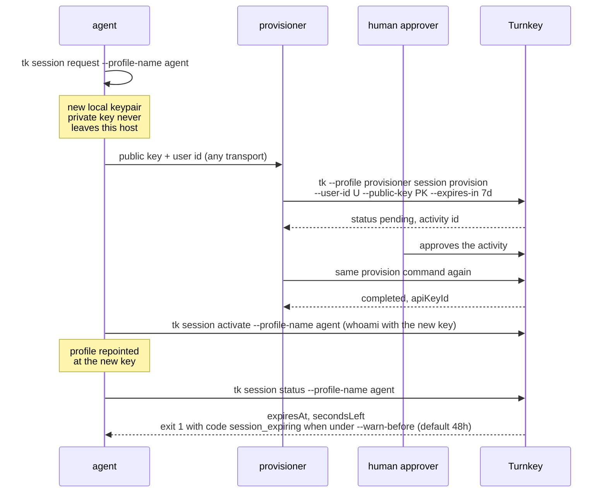

# Session keys

A session key is a Turnkey API key with an expiration. `tk session` splits its
lifecycle so that the private key never leaves the machine that uses it and the
identity allowed to register keys never sees it.



Only the public key and user id cross from the agent to the provisioner; the
provisioner registers the expiring key and never sees the private half; the
approver signs off on the registration activity.

## Request (agent)

```bash
tk session request --profile-name agent

# Drop an unregistered request and start a new one.
tk session request --profile-name agent --replace
```

The profile must already exist. The request is remembered under
`~/.config/turnkey/tk/sessions/pending/<profile>.json` until `activate` uses it.

## Provision (provisioner)

```bash
# Registers the agent's public key on its user as an expiring API key.
tk --profile provisioner session provision --user-id USER_UUID --public-key PK --expires-in 7d
```

## Activate (agent)

```bash
# Verifies the pending key with whoami, then repoints the profile at it.
tk session activate --profile-name agent
```

## Status

```bash
# Reports the key's expiresAt, secondsLeft, and expiresIn.
tk session status --profile-name agent

# Exits 1 with code session_expiring when less than 24h is left (default 48h),
# which makes it usable as a cron check.
tk session status --profile-name agent --warn-before 24h
```

## Policies

```bash
# Let the provisioner register keys, but only with a human approver's sign-off.
tk policy create --name provision-session-keys --effect allow \
  --condition "activity.type == 'ACTIVITY_TYPE_CREATE_API_KEYS_V2'" \
  --consensus "approvers.any(user, user.id == 'PROVISIONER_USER_ID') && approvers.any(user, user.tags.contains('HUMAN_TAG_ID'))"

# By default Turnkey lets a user register keys on itself, so a short-lived
# agent key could mint a permanent one; deny the agent credential activities.
tk policy create --name agents-no-credentials --effect deny \
  --condition "activity.resource == 'CREDENTIAL'" \
  --consensus "approvers.any(user, user.tags.contains('AGENT_TAG_ID'))"
```
